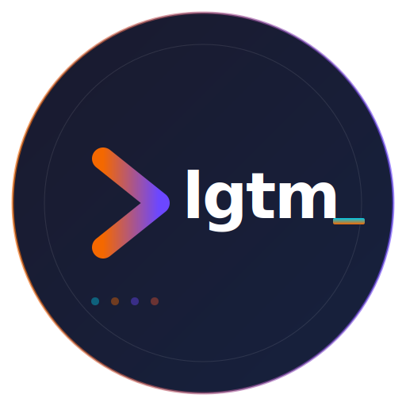
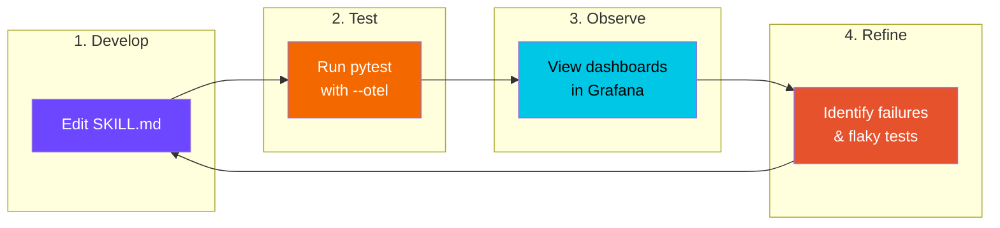
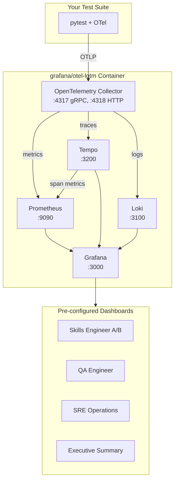

<p align="center">
  
</p>

<h1 align="center">OTEL-LGTM-Skills</h1>

<p align="center">
  <strong>Observability-driven skill refinement for Claude Code plugins.</strong><br>
  <sub>Test, measure, visualize, and improve complex AI skills with full traceability.</sub>
</p>

<table align="center">
<tr>
<td align="center">
<h2>4</h2>
<sub>Role-based<br>dashboards</sub>
</td>
<td align="center">
<h2>1</h2>
<sub>Docker command<br>to run all</sub>
</td>
<td align="center">
<h2>6</h2>
<sub>Observability<br>components</sub>
</td>
<td align="center">
<h2>0</h2>
<sub>Config files<br>to write</sub>
</td>
</tr>
</table>

<p align="center">
  <a href="https://hub.docker.com/r/grafana/otel-lgtm"></a>
  <a href="https://hub.docker.com/r/grafana/otel-lgtm"></a>
  
  
  <a href="https://github.com/grandcamel/OTEL-LGTM-Skills"></a>
  
</p>

<p align="center">
  <a href="#the-problem"><strong>The Problem</strong></a> &bull;
  <a href="#quick-start">Quick Start</a> &bull;
  <a href="#skill-refinement-workflow">Workflow</a> &bull;
  <a href="#role-based-dashboards">Dashboards</a> &bull;
  <a href="#architecture">Architecture</a>
</p>

---

## The Problem

**Complex AI skills are hard to improve systematically.**

When Claude Code routes user prompts to skills, failures are often silent, intermittent, or dependent on subtle prompt variations. Traditional logging provides fragments; you need the complete picture.

<table>
<tr>
<td width="50%">

### Without Observability
```
- Run tests, see pass/fail
- Check logs manually for errors
- Guess which prompts are problematic
- No idea if a change improves edge cases
- Flaky tests? Which ones? How flaky?
```
*Slow iteration, missed regressions.*

</td>
<td width="50%">

### With OTEL-LGTM-Skills
```
- See exactly which skills get called
- Track routing confidence over time
- Identify flaky tests automatically
- Compare A/B skill versions visually
- Share progress with stakeholders
```
*Data-driven refinement at any scale.*

</td>
</tr>
</table>

---

## Quick Start

### 1. Run the Stack

```bash
# Clone and start (recommended)
git clone https://github.com/grandcamel/OTEL-LGTM-Skills.git
cd OTEL-LGTM-Skills
docker-compose up -d

# Or use Docker directly
docker run --name lgtm -p 3000:3000 -p 4317:4317 -p 4318:4318 -p 9090:9090 \
  grafana/otel-lgtm:latest
```

### 2. Run Your Skill Tests with OTel Export

```bash
# Example: JIRA Assistant routing tests
pytest test_routing.py --otel --otlp-endpoint http://localhost:4318 -v

# Any OpenTelemetry-instrumented test suite works
export OTEL_EXPORTER_OTLP_ENDPOINT=http://127.0.0.1:4318
pytest your_skill_tests.py
```

### 3. View Results in Grafana

Navigate to http://127.0.0.1:3000 - dashboards are pre-loaded:

| Dashboard | Persona | Focus |
|-----------|---------|-------|
| **Skills Engineer A/B** | Developer | Version comparison, commit-level accuracy |
| **QA Engineer** | Tester | Test suite health, flaky test detection |
| **SRE Operations** | Operations | API costs, rate limits, system health |
| **Executive Summary** | Leadership | Trend lines, week-over-week metrics |

---

## Skill Refinement Workflow



### The Iteration Loop

1. **Develop**: Modify your SKILL.md description, examples, or routing hints
2. **Test**: Run your test suite with OpenTelemetry export enabled
3. **Observe**: Check dashboards for pass rates, timing, and routing patterns
4. **Refine**: Use failure traces to understand why routing failed, then iterate

**Each test run generates spans** with attributes like:
- `test.category` - The skill category being tested
- `test.result` - pass/fail with expected vs actual routing
- `routing.confidence` - How confident the model was
- `skill.md.hash` - Content hash for A/B comparison
- `vcs.branch`, `vcs.commit.sha` - Git context for regression detection

---

## Role-Based Dashboards

### Skills Engineer A/B

<details>
<summary><strong>For developers comparing skill versions</strong></summary>

**Panels include:**
- Accuracy by commit SHA and branch
- Pass rate comparison between SKILL.md versions
- Individual test case drill-down with failure traces
- Routing confidence distribution

**Key questions answered:**
- Did my SKILL.md change improve routing accuracy?
- Which test cases regressed after the last commit?
- How does `main` compare to my feature branch?

</details>

### QA Engineer

<details>
<summary><strong>For testers monitoring test suite health</strong></summary>

**Panels include:**
- Total tests, passed, failed, skipped counts
- Flaky test detection (30-70% pass rate over 7 days)
- Test duration trends and outliers
- Category-level breakdown

**Key questions answered:**
- Which tests are flaky and need stabilization?
- Are test durations increasing over time?
- What's the health of each skill category?

</details>

### SRE Operations

<details>
<summary><strong>For operations monitoring costs and reliability</strong></summary>

**Panels include:**
- API cost per test run (token usage)
- Rate limit events and retry patterns
- P50/P95/P99 latency distributions
- Parallel worker utilization

**Key questions answered:**
- What's our daily/weekly API spend on testing?
- Are we hitting rate limits during CI runs?
- Which tests are most expensive to run?

</details>

### Executive Summary

<details>
<summary><strong>For stakeholders tracking progress</strong></summary>

**Panels include:**
- Week-over-week accuracy trends
- Skill coverage heatmap
- Regression alerts
- Overall routing success rate

**Key questions answered:**
- Is our skill quality improving over time?
- Are we on track for our accuracy SLO?
- Which skill areas need investment?

</details>

---

## What Gets Captured

### Span Metrics (via Tempo)

| Dimension | Description | Example |
|-----------|-------------|---------|
| `test.id` | Unique test case ID | `TC001` |
| `test.category` | Skill category | `agile`, `search`, `issue` |
| `test.result` | Routing outcome | `pass`, `fail` |
| `test.actual_skill` | Skill that was routed to | `jira-agile` |
| `test.expected_skill` | Expected skill | `jira-agile` |
| `claude.model` | Model used | `haiku`, `sonnet`, `opus` |
| `routing.confidence` | Confidence level | `low`, `medium`, `high` |
| `skill.version` | SKILL.md version | `1.2.0` |
| `skill.md.hash` | Content hash | `abc123` |
| `vcs.branch` | Git branch | `feat/improve-routing` |
| `vcs.commit.sha` | Git commit | `a1b2c3d` |
| `worker.id` | Parallel worker | `worker-0` |

### Recording Rules (via Prometheus)

Pre-configured rules for common queries:

| Rule | Description |
|------|-------------|
| `routing_test:pass_rate_7d` | Pass rate per test over 7 days |
| `routing_test:pass_rate_24h` | Pass rate per test over 24 hours |
| `routing_test:flaky_tests` | Tests with 30-70% pass rate (flaky) |
| `routing_test:failing_tests` | Tests with <30% pass rate |
| `routing_test:accuracy_1h` | Overall accuracy for alerting |
| `routing_test:cost_per_test_24h` | Average cost per test |

---

## Architecture



### How It Works

1. **Test runs emit spans** via OpenTelemetry SDK
2. **Collector receives** OTLP data on ports 4317 (gRPC) or 4318 (HTTP)
3. **Tempo stores traces** and generates span metrics for Prometheus
4. **Prometheus stores metrics** with pre-configured recording rules
5. **Grafana visualizes** via role-based dashboards

---

## Configuration

### Using docker-compose (Recommended)

Config files are mounted for easy iteration:

```bash
docker-compose up -d      # Start stack
docker-compose restart    # Reload after config changes
docker-compose logs -f    # Follow logs
docker-compose down       # Stop and remove
```

### Mounted Config Files

| File | Purpose |
|------|---------|
| `docker/tempo-config.yaml` | Span metric dimensions |
| `docker/prometheus.yaml` | Resource attribute promotion |
| `docker/prometheus-rules.yaml` | Recording rules for flaky detection |
| `docker/grafana-dashboards.yaml` | Dashboard provisioning |
| `docker/grafana-dashboard-*.json` | Dashboard definitions |

### Data Persistence

Test data persists in `./container/`:

```
container/
├── grafana/       # Dashboard state, preferences
├── prometheus/    # Metrics TSDB
├── tempo/         # Trace storage
└── loki/          # Log storage
```

### Environment Variables

| Variable | Purpose |
|----------|---------|
| `OTEL_EXPORTER_OTLP_ENDPOINT` | Collector endpoint for tests |
| `OTEL_EXPORTER_OTLP_PROTOCOL` | Protocol (http/protobuf, grpc) |
| `GF_AUTH_ANONYMOUS_ENABLED` | Enable anonymous Grafana access |

---

## Components

| Component | Port | Purpose |
|-----------|------|---------|
| **OpenTelemetry Collector** | 4317, 4318 | Receives test telemetry |
| **Prometheus** | 9090 | Metrics storage + recording rules |
| **Tempo** | 3200 | Trace storage + span metrics |
| **Loki** | 3100 | Log aggregation |
| **Pyroscope** | 4040 | Continuous profiling (optional) |
| **Grafana** | 3000 | Dashboards + visualization |

---

## Instrumenting Your Tests

### Python (pytest)

```python
from opentelemetry import trace
from opentelemetry.sdk.trace import TracerProvider
from opentelemetry.sdk.trace.export import BatchSpanProcessor
from opentelemetry.exporter.otlp.proto.http.trace_exporter import OTLPSpanExporter

# Setup tracer
provider = TracerProvider()
provider.add_span_processor(BatchSpanProcessor(OTLPSpanExporter()))
trace.set_tracer_provider(provider)
tracer = trace.get_tracer("skill-tests")

def test_routing_accuracy():
    with tracer.start_as_current_span("routing_test_TC001") as span:
        span.set_attribute("test.category", "agile")
        span.set_attribute("test.expected_skill", "jira-agile")

        # Run your test
        result = route_prompt("Create a sprint")

        span.set_attribute("test.actual_skill", result.skill)
        span.set_attribute("test.result", "pass" if result.correct else "fail")
```

### Existing JIRA Assistant Tests

The JIRA Assistant Skills project includes full OTel instrumentation:

```bash
cd plugins/jira-assistant-skills/skills/jira-assistant/tests

# Run with OTel export
pytest test_routing.py --otel --otlp-endpoint http://localhost:4318 -v

# Fast iteration with parallel execution
./fast_test.sh --fast --parallel 4 --otel
```

---

## Build from Source

```bash
# Clone the repository
git clone https://github.com/grandcamel/OTEL-LGTM-Skills.git
cd OTEL-LGTM-Skills

# Build with custom configs baked in
cd docker/ && docker build . -t otel-lgtm-skills

# Or use docker-compose with mounted configs
docker-compose up -d
```

---

## Related Projects

| Project | Description |
|---------|-------------|
| [Assistant-Skills](https://github.com/grandcamel/Assistant-Skills) | Build Claude Code skills in minutes |
| [JIRA-Assistant-Skills](https://github.com/grandcamel/JIRA-Assistant-Skills) | JIRA automation with natural language |
| [Confluence-Assistant-Skills](https://github.com/grandcamel/Confluence-Assistant-Skills) | Confluence operations via Claude |

---

## License

Apache 2.0 License - see [LICENSE](LICENSE) for details.

Based on [grafana/docker-otel-lgtm](https://github.com/grafana/docker-otel-lgtm).

---

<p align="center">
  <strong>Stop guessing. Start measuring.</strong>
  <br>
  <sub>Observability-driven skill refinement for teams who ship quality AI.</sub>
</p>
